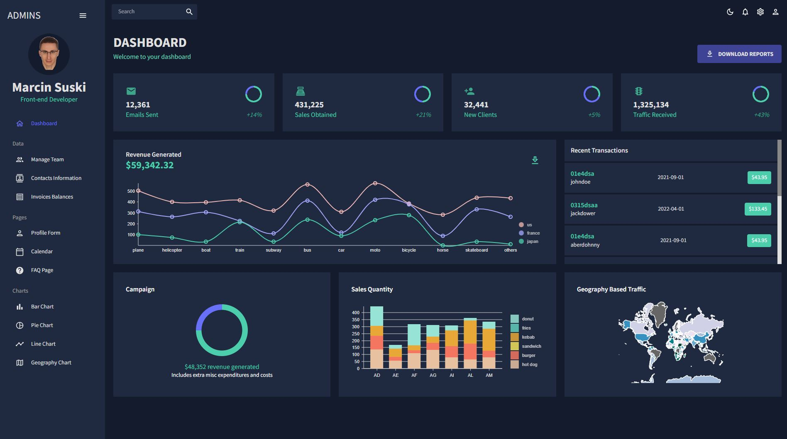

# Admin dashboard template - frontend

 
## 💡 Concept
Frontend admin dashboard template made in React.js. styled with MUI, containing light-mode/dark-mode with various sections.
 
## 🔍 Project overview 
Admin dashboard contains sections with various types of data: tables with users data, charts, profile form, calendar,FAQ page, general dashboard.

## 📦 Tech stack:
- React.js
- MUI
- Nivo library

## 💻 Demo
Click the link and check the app: [Link](https://ms-dashboard-frontend.netlify.app/)

### Screenshot

## 💾 Installation
git clone https://github.com/marcinsuski/dashboard.git  
npm install  
npm start  

## ☎️ Contact
In case of any comments or advice, You can e-mail me or use Issues :)

## 🧙‍♂️ Author
- GitHub - [Marcin Suski](https://github.com/marcinsuski)
- LinkedIn - [marcin-suski](https://www.linkedin.com/in/marcin-suski/)
- Porftolio - [marcinsuski.pl](https://marcinsuski.pl)
